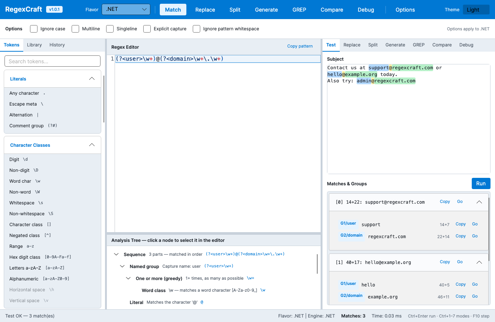
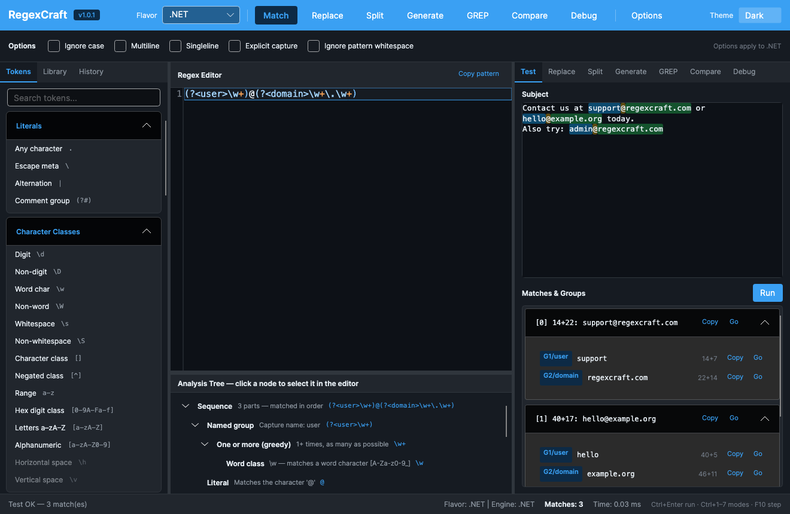
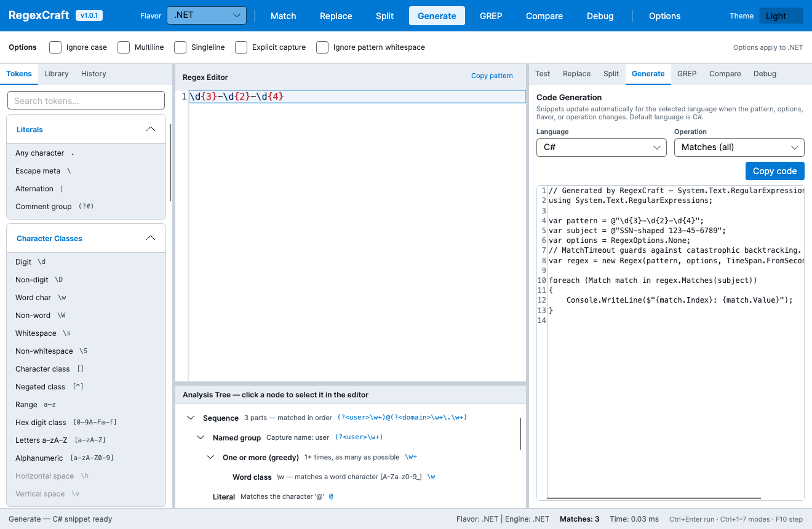
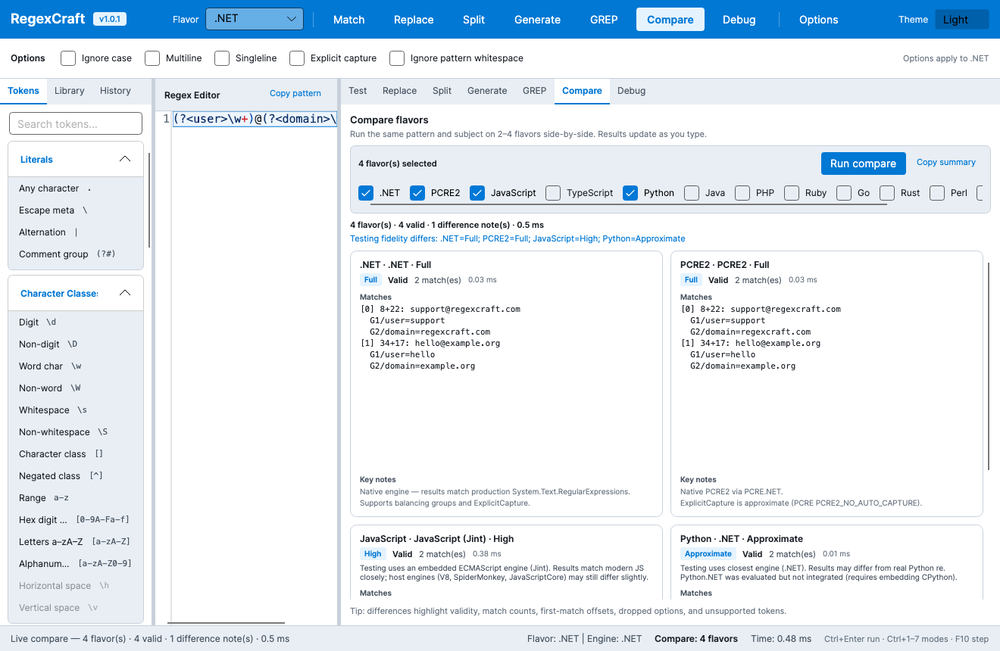

# RegexCraft

**Modern, cross-platform regular expression workbench** for exploring, testing, replacing, grepping, comparing, debugging, and generating code across many regex flavors.

[](https://github.com/MarshallMoorman/RegexCraft/actions/workflows/ci.yml)
[](https://github.com/MarshallMoorman/RegexCraft/releases)

| | |
|---|---|
| **Version** | **1.1.0** |
| **Domain** | [regexcraft.com](https://regexcraft.com) |
| **Stack** | .NET 10 · Avalonia 12 · AvaloniaEdit · Jint · NUnit · Serilog |
| **License** | MIT |
| **Status** | Stable 1.1 |



<p align="center">
  
  
</p>

<p align="center">
  
</p>

---

## Download

**Pre-built portable binaries** are published on every version tag:

**[→ GitHub Releases](https://github.com/MarshallMoorman/RegexCraft/releases)**

| Asset | Platform |
|-------|----------|
| `RegexCraft-win-x64.zip` | Windows x64 |
| `RegexCraft-linux-x64.zip` | Linux x64 |
| `RegexCraft-osx-x64.zip` | macOS Intel |
| `RegexCraft-osx-arm64.zip` | macOS Apple Silicon |

Unzip and run `RegexCraft.App` (or `RegexCraft.App.exe` on Windows) from the extracted folder. Builds are self-contained (include the .NET runtime).

See [docs/development/packaging.md](docs/development/packaging.md) for how releases are cut and how to publish from source.

---

## Features

- **Multi-flavor testing** — .NET, PCRE2, **JavaScript** (Jint), TypeScript, Python, Java, PHP, Ruby, Go, Rust, Perl, Kotlin, Swift  
- **Compare mode** — side-by-side results for 2–4 flavors (validity, matches, groups, fidelity, key differences, copyable summary); **smart right-panel width** expands for cards and restores when you leave  
- **Debug step-through** — educational walk-through for the **.NET** engine (F10/F11, pattern + subject focus, captures); clear “not available” for other engines ([guide](docs/user/debugging.md))  
- **Hardened flavor definitions** — supported options, token support matrices, known differences, preferred codegen language  
- **Clear fidelity** — Full / High / Approximate banners; token palette dims unsupported constructs (e.g. RE2 limits for Go/Rust)  
- **Significant automated tests** — deep coverage per real engine; core + mapping + banner + token + codegen + Compare + **Debug** tests  
- **Professional editor** — AvaloniaEdit with high-contrast light/dark regex syntax highlighting, line numbers, and live analysis  
- **Live Match mode** — subject highlighting for matches and capture groups, **equal-width** expandable match cards with Copy / Go  
- **Replace & Split** — live preview that fills the panel cleanly, substitution highlighting, backreferences (`$1`, `${name}`, …)  
- **GREP** — search and replace across folders with include/exclude globs, async progress, cancellation, dry-run, and backups  
- **Code generation** — C#, JavaScript, TypeScript, Python, PHP, Java, Go, Rust, Ruby, Perl, Kotlin, Swift  
- **Analysis Tree** — hierarchical breakdown of the pattern; click a node to select it in the editor  
- **Token palette** — searchable text-only tokens, flavor-aware support  
- **Library & History** — **20 built-in** common patterns (email, URL, IP, dates, UUID, …) plus user saves with categories/tags; searchable history  
- **Light / Dark / System themes** — preference **persisted and restored** correctly across restarts  
- **Custom About dialog** + **RegexCraft application icon** (no Avalonia defaults)  
- **GitHub Actions** — CI on every push/PR; tagged releases attach multi-RID portable zips  
- **Keyboard shortcuts** — Ctrl+Enter (⌘+Enter) to run; Ctrl+1–7 for modes; F10/F11 for Debug step  

## Engines & flavors

### Real engines

| Id | Display | Match | Replace | Split | GREP | Compare | Debug | Notes |
|----|---------|-------|---------|-------|------|---------|-------|-------|
| `dotnet` | .NET | Yes | Yes | Yes | Yes | Yes | **Yes** | `System.Text.RegularExpressions` |
| `pcre2` | PCRE2 | Yes | Yes | Yes | Yes | Yes | — | PCRE.NET |
| `javascript` | JavaScript (Jint) | Yes | Yes | Yes | Yes | Yes | — | ECMAScript for JS / TypeScript flavors |

### Selectable flavors (fidelity)

| Flavor | Engine | Testing fidelity |
|--------|--------|------------------|
| .NET | `dotnet` | **Full** |
| PCRE2 | `pcre2` | **Full** |
| JavaScript | `javascript` | **Full** |
| TypeScript | `javascript` | **Full** (same engine) |
| PHP | `pcre2` | **High** |
| Python, Java, Kotlin, Swift | `dotnet` | **Approximate** |
| Go, Rust | `dotnet` | **Approximate** (RE2 limits modeled in tokens/docs) |
| Ruby, Perl | `pcre2` | **Approximate** |

See [docs/user/flavors.md](docs/user/flavors.md) for option matrices, known differences, and engine evaluation notes.

**Engine evaluation:** Python.NET and RE2.Managed were evaluated and not integrated (embedding cost / maintenance). Go/Rust RE2 limits are modeled in the flavor layer; JS fidelity is strengthened via Jint tests and documented gaps.

## Build & run

```bash
# Prerequisites: .NET 10 SDK
dotnet build
dotnet test
dotnet run --project src/RegexCraft.App
```

Publish a self-contained binary (example):

```bash
dotnet publish src/RegexCraft.App -c Release -r osx-arm64 --self-contained
```

See **[docs/development/packaging.md](docs/development/packaging.md)** for Windows / Linux / macOS publish commands, icons, portable zips, and how to trigger GitHub Actions release builds.

Logs are written under `logs/` (gitignored).  
Library, History, and Settings live in the OS application-data folder:

- **macOS**: `~/Library/Application Support/RegexCraft`
- **Windows**: `%AppData%/RegexCraft`
- **Linux**: `~/.config/RegexCraft` (or equivalent ApplicationData)

## CI / GitHub Actions

| Workflow | When | What |
|----------|------|------|
| [CI](.github/workflows/ci.yml) | Push / PR to `main` | Restore, Debug + Release build, full NUnit suite, TRX upload |
| [Publish](.github/workflows/publish.yml) | Manual or tag `v*` | Test → publish win-x64 / linux-x64 / osx-x64 / osx-arm64 → **GitHub Release** on tag |

No secrets are required for the basic CI path. Tag a version (`git tag v1.0.0 && git push origin v1.0.0`) to cut a Release; see packaging docs.

## Running the tests

```bash
# Full suite (unit + headless UI + screenshots)
dotnet test

# By category
dotnet test --filter Category=Engines
dotnet test --filter Category=Flavors
dotnet test --filter Category=Compare
dotnet test --filter Category=Analysis
dotnet test --filter Category=Codegen
dotnet test --filter Category=Library
dotnet test --filter Category=Grep
dotnet test --filter Category=ViewModels
dotnet test --filter Category=UI
dotnet test --filter Category=Headless
dotnet test --filter Category=Screenshots
dotnet test --filter Category=Branding

# Engines + Flavors + Compare
dotnet test --filter "Category=Engines|Category=Flavors|Category=Compare"
```

Unit tests are fast. Headless UI tests use **Avalonia.Headless.NUnit** with Skia so they run on CI without a display.

### Regenerating screenshots

Screenshot tests render the main window and About dialog via `CaptureRenderedFrame()` and write PNGs to `docs/screenshots/`:

```bash
dotnet test --filter Category=Screenshots
```

| File | Description |
|------|-------------|
| `main-test-light.png` | Match mode, light theme |
| `main-test-dark.png` | Match mode, dark theme |
| `main-replace.png` | Replace mode |
| `main-generate.png` | Generate mode (C#) |
| `main-grep.png` | GREP mode |
| `main-compare.png` | Compare mode (multi-flavor cards) |
| `main-library.png` | Library sidebar |
| `about-light.png` / `about-dark.png` | About RegexCraft dialog |

Do **not** commit temporary or low-quality captures; only regenerate and keep images that look good in docs.

## Solution layout

```
RegexCraft/
├── .github/workflows/         # CI + Publish (GitHub Releases)
├── src/
│   ├── RegexCraft.Core/       # Flavors, Compare, tokens, analysis, GREP, codegen, library, settings
│   ├── RegexCraft.Engines/    # DotNet + PCRE2 + JavaScript (Jint)
│   └── RegexCraft.App/        # Avalonia UI + AvaloniaEdit + icon + About
├── tests/RegexCraft.Tests/    # NUnit unit + Avalonia headless UI + screenshots
├── docs/
│   ├── screenshots/           # Auto-captured PNGs for README/docs
│   ├── user/                  # End-user guides (incl. comparing.md, flavors.md)
│   └── development/           # Architecture, packaging, phase requirements
├── Directory.Build.props      # Version (1.0.1)
└── AGENTS.md / HANDOFF.md
```

## Keyboard shortcuts

| Shortcut | Action |
|----------|--------|
| Ctrl+Enter (⌘+Enter on macOS) | Run current mode |
| Ctrl+1 | Match / Test |
| Ctrl+2 | Replace |
| Ctrl+3 | Split |
| Ctrl+4 | Generate |
| Ctrl+5 | GREP |
| Ctrl+6 | Compare |

## Documentation

- [Getting started](docs/user/getting-started.md)
- [Flavors & testing fidelity](docs/user/flavors.md)
- [Testing regexes](docs/user/testing-regexes.md)
- [Comparing flavors](docs/user/comparing.md)
- [Replacing](docs/user/replacing.md)
- [GREP (file search & replace)](docs/user/grepping.md)
- [Generating code](docs/user/generating-code.md)
- [Library and History](docs/user/library-and-history.md)
- [Theme & appearance](docs/user/theme-and-appearance.md)
- [Packaging & publish / GitHub Releases](docs/development/packaging.md)
- [Architecture](docs/development/architecture.md)
- [Changelog](docs/CHANGELOG.md)
